# Splittermond für Foundry VTT

Dieses Foundry VTT - System implementiert das deutsche Rollenspiel-System [Splittermond](https://splittermond.de/) des [Uhrwerk Verlags](https://www.uhrwerk-verlag.de/). Dieses Fanprojekt implementiert einzelne Regeln, kann jedoch nicht Regeltexte und ein Gesamtkompendium bereitstellen.

_Dieses System befindet sich noch in Entwicklung. Änderungen können jederzeit vorgenommen werden, die eine Abwärtskompatibilität beeinträchtigen._

**Installations-URL:** [https://bitbucket.org/rpgframework-cloud/splittermond-fvtt/raw/main/system.json](https://bitbucket.org/rpgframework-cloud/splittermond-fvtt/raw/main/system.json)

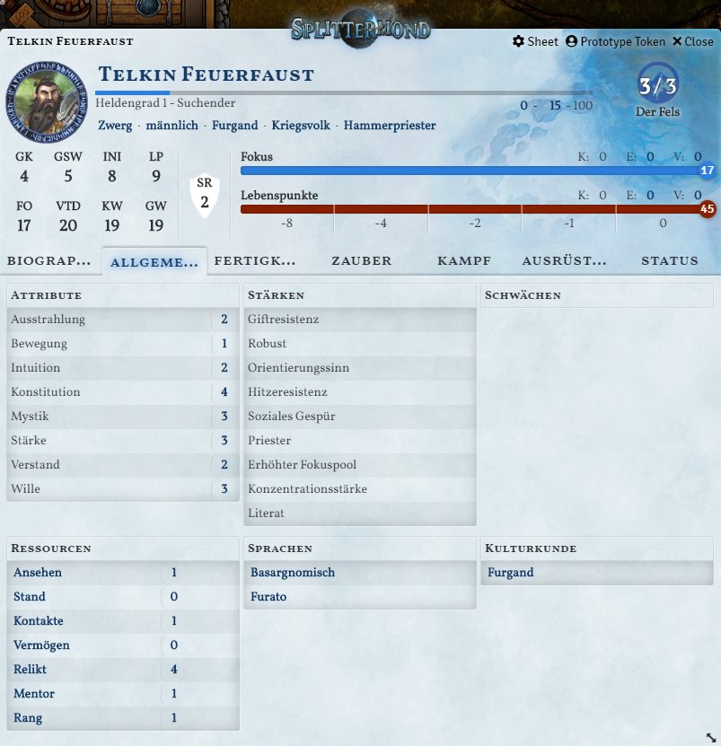

## Features

### Genesis Import

Jeder Charakter aus dem Charaktererstellungstool Gensis lässt sich als JSON-Datei importieren.

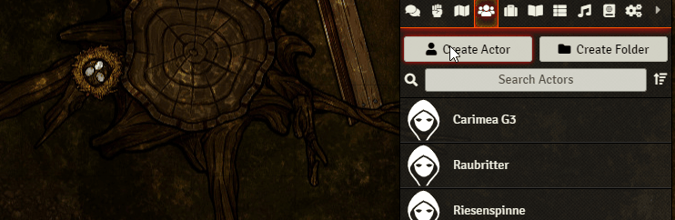

### Automatische Berechnung von Werten

Alle abgeleiten Werte sowie die Fertigkeitswerte werden aus den Attributen und Fertigkeitspunkten automatisch berechnet.

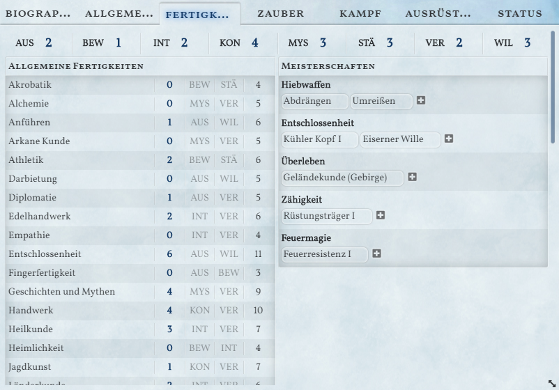

### Proben

Es können alle Fertigkeitsproben per Klick auf die Fertigkeit, den Zauber oder den Angriff durchgeführt werden.

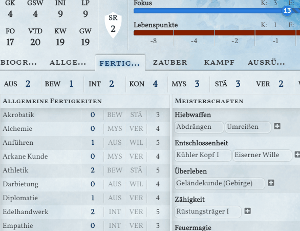

### Verwaltung von Zauber

Zauber können per Drag-and-Drop auf das Charakterblatt gezogen werden. Diese Werden nach Magieschule geordnet angezeigt.

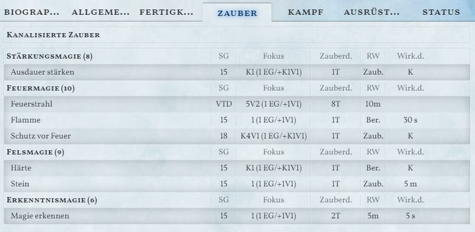

Per Klick auf den Zaubernamen wird eine entsprechende Probe ausgeführt. Zusätzlich können die Zauberkosten durch Klick auf die Kosten abgerechnet werden. Dabei können die kanalisierten Fokuspunkte nach Zauber getrennt verwaltet werden.

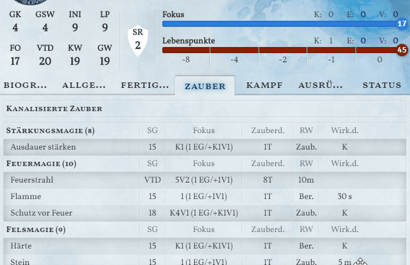

### Ausrüstung

Alle Ausrüstungsgegenstände können getrennt nach ihrem Typ organisiert werden. Dabei lassen sich Waffen, Rüstungen und Schilde zusätzlich als "ausgerüstet" markiert werden.

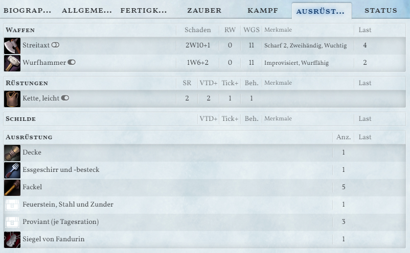

### Kampfaktionen

Abhängig von den ausgerüsteten Waffen wird unter dem Tab "Kampf" die entsprechenden Angriffsoptionen aufgelistet.

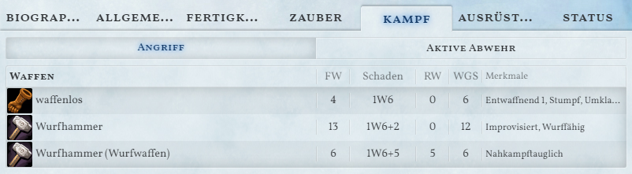

Durch anklicken des Waffennamens kann eine Probe ausgelöst werden. Ist in Foundry VTT ein Ziel ausgewählt, wird dessen Verteidigung automatisch als Schwierigkeit eingetragen.

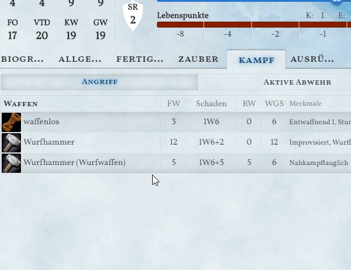

Durch einen Klick auf den Schaden kann ein Schadenswurf erzeugt werden. Dabei werden auch die Merkmale der Waffe berücksichtigt.

Unter "Aktive Abwehr" werden alle _Aktive Abwehr_-Möglichkeiten der aktuellen Waffe sowie weitere Fertigkeiten aufgelistet.

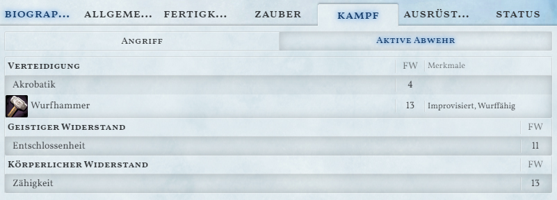

Bei einem Wurf auf die Aktive Abwehr wird das Waffenmerkmal _Defensiv_ hinsichtlich der Erhöhung der Verteidigung berücksichtigt.

### Modifikatoren

Alle Gegenstände als auch Meisterschaften, Stärken, Zustände und Zaubereffekte können Werte innerhalb des Sheets modifizieren.

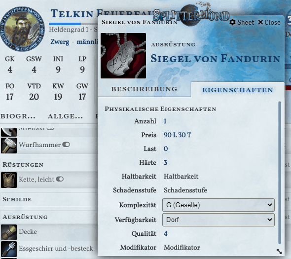

Eine Liste möglicher Modifikatoren wird noch bereitgestellt.

### Patzertabellen

Kampf- und Zauberpatzertabellen sind implementiert. Per Drag-n-Drop können die Erwürfelten Zustände auf das Charakterblatt gezogen werden. Mali durch Zustände wie z.B. _Erschöpft_ werden im Charakterbogen berücksichtigt.

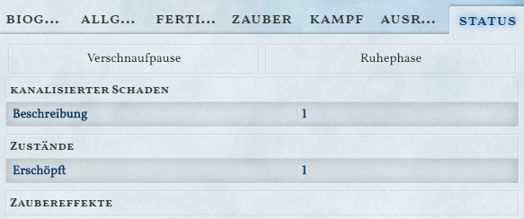

### Fertigkeitswurf fordern

Der Spielleiter kann mittels Makro einen Fertigkeitswurf fordern. Dafür aktiviert er das Makro und wählt die Fertigkeit und Schwierigkeit. Es wird eine Chatnachricht erstellt auf die die Spieler klicken können um einen Fertigkeitswurf auszuführen


Damit diese Funktion genutzt werden kann, müssen die Macros `requestSkillCheck` und `skillCheck` aus dem Makro-Kompendium importiert werden. Zusätzlich muss den Spielern die Berechtigung zur Nutzung des `skillCheck`-Makros freigegeben werden (Eintrag "Permissions" im Kontext-Menü des Makro-Directory).

### Tickleiste

Der in Foundry eingebaute "Combat Tracker" lässt sich nun als Tickleiste verwenden. Die Spieler können auf ihre Waffengeschwindigkeit, Zauberdauer etc. klicken um ihre Ticks zu erhöhen. Außerdem kann ein Spieler auf das "Abwarten/Bereithalten"-Feld gesetzt werden.

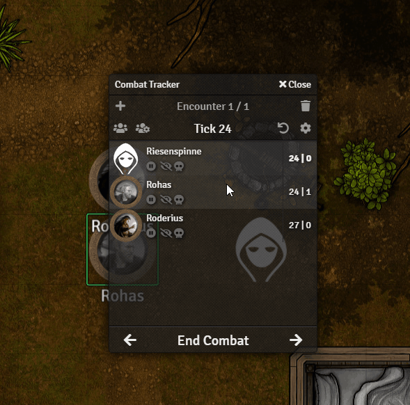

### NSC Bogen

Der NSC-Bogen bietet für Nicht-Spieler-Charaktere die Möglichkeit _abgeleitete Werte_ sowie eine Auswahl an Fertigkeiten einzutragen.

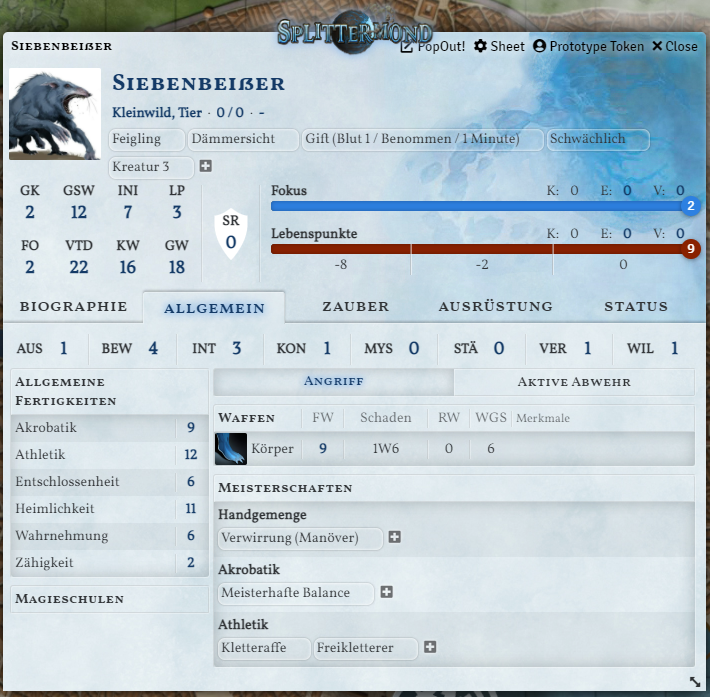
Gegnermerkmale wie _Schwächlich_ haben aufgrund der einstellbaren Modifikatoren Auswirkungen auf die Anzahl der Wundstufen.

## Entwicklung

Das Projekt baut mittels `vite` eine ES6-Webanwendung. Die Anwendung wird in den Ordner `dist` gebaut. Um Änderungen automatisch auf seinem Server zu haben, muss der Order `dist` in Foundry VTT als System-Ordner hinzugefügt werden.
Bash:

```bash
ln -s /path/to/splittermond-fvtt/dist /path/to/foundryvtt/Data/systems/splittermond
```

PowerShell:

```powershell
New-Item -ItemType SymbolicLink -Path "C:\path\to\foundryvtt\Data\systems\splittermond" -Value "C:\path\to\splittermond-fvtt\dist"
```

Es sollte darauf geachtet werden, dass das Projekt nicht gebaut werden kann, wenn der dist ordner als Splittermond-Systemordner in Foundry VTT eingetragen ist,
da der Server die Kompendium-Dateteien offen hält, sodass sie vom Build-Prozess nicht überschrieben werden können.

Zur Entwicklung empfiehlt es sich deshalb, das Projekt mit `npm run dev` zu starten. Die Anwendung wird dann unter `localhost:30001` bereitgestellt,
und zwar als Proxy zum eigentlichen Foundry server, von dem erwartet wird, dass er unter `localhost:30000` läuft. Der dev Server lädt
automatisch neu, wenn Änderungen gespeichert werden, sodass man immer auf einem aktuellen Stand ist.

### Standards

Das Projekt benutzt `Typescript` und `prettier` um einen einheitlichen Code-Stil zu gewährleisten. Es wird in GitHub
sichergestellt, dass nur korrekt typisierter, formatierter und getesteter Code in den Hauptzweig gemerged werden kann.
Es empfiehlt sich die IDE anzuweisen die entsprechenden Konfigurationen zu benutzen.

### Tests

Es gibt im Repo zwei Arten von Tests: "Unit-Tests" und "Integration-Tests".

#### Unit-Tests

Unit-Tests kommen ohne FoundryVTT Programm aus und können lokal, und in Github ausgeführt werden. Sie sollten eingesetzt
werden um einzelne Programmbestandteile (eine Funktion, eine Klasse) automatisiert zu überprüfen.

Sie verlassen sich dabei auf eine umfangreiche Liste an Mocks, die verwendeten Foundry-Klassen und Funktionen durch
minimale Definitionen ersetzen. Meistens sollten Mocks lokal mit dem `sinon` Framework erstellt werden. Es gibt aber
auch eine Reihe globaler Mocks für die Tests:

- `foundryMocks.mjs`: Definiert Klassen und einige Methoden der Foundry API die
- `RollMock.ts`: Eine Klasse zum Ersetzen der Foundry `Roll` Klasse und ihrer Terme. Kann mit einfachen Würfelwürfen der
  Sorte `1W6 +3` arbeiten.
- `settingsMock.ts`: Erlaubt das Arbeiten mit Nutzerkonfigurationen in Tests.

#### Integration Tests

Integration Tests konzentrieren sich auf das Testen der Foundry API (so sie von uns benutzt wird), sowie tests die viele
Foundry Komponenten, insbesondere GUI Komponenten, involvieren. Sie sind so gebaut, dass in einer frischen Splittermond
Welt funktionieren.

Zum Ausführen muss in einer laufenden Foundry VTT Instanz das Modul [`@ethaks/fvtt-quench`](https://github.com/Ethaks/FVTT-Quench)
installiert und aktiviert sein. Danach gibt es in der rechten Seitenleiste einen neuen Button "QUENCH", mit
dem sich ein Menü öffnet, in dem die Tests ausgeführt werden können.

### Architektur

#### Isolation

Um das Testen mit Unit-Tests als auch die Detektion von Änderungen an der Foundry API zu erleichtern, dürfen Aufrufe von
Foundry ausschließlich im `api` Modul erfolgen. Dabei sollen keine Vorkehrungen oder Typisierungen erfolgen, die Klassen
in anderen Modulen des Splittermondsystems benutzen. Zum Beispiel sollte ein Aufruf zum Finden eines Items so definiert
sein.

```ts
// api Package
function getItem(name: string): foundry.documents.Item {
    return game.items.getName(name);
}
```

Des Weiteren sollte die Funktion, oder zumindest die Existenz der so gekapselten Funktion mittels eines
Integration-Tests überprüft werden.

### Modularisierung

Das System sollte in einzelne Module gegliedert sein, die jeweils eine klar umrissene Aufgabe erfüllen. Insbesondere
vermieden werden sollte die Registrierung oder Konfiguration von Komponenten an zentralen Stellen, die dann alle Module
kennen muss. Stattdessen sollten Module sich selbst registrieren, wenn sie geladen werden.

### Kontinuierliche Integration

Das Projekt benutzt Github Actions um bei jedem Pull-Request die Unit-Tests auszuführen. Änderungen die die Tests
brechen, dürfen nicht in den Hauptzweig gemerged werden. Integrationstests werden aktuell noch nicht automatisch
ausgeführt. Und sollten bei jedem Pull-Request manuell ausgeführt werden.

### Typisierung

Das Projekt setzt auf strikte Typisierung mittels Typescript. `Any` Typen sind zu vermeiden. Wenn Foundry Objekte
benutzt
werden wird eine Kopie der Foundry Typdefinition (kann man in
der [Foundry API Dokumentation](https://foundryvtt.com/api/) nachschlagen) im api Ordner erstellt. Auf Foundry Objekte
sollte nur im API Ordner zugegriffen werden.
Die Entscheidung für eigene Typdefinitionen ist historisch bedingt; Sie wurde getroffen als die Foundry Typdefinitionen
der 'League-of-Foundry-Developers' nicht auf Stand waren. Dies war auf Grund eines Bugs in Typescript der Fall.
Mittlerweile wird
an dem Typsystem wieder entwickelt. Allerdings gilt, dass die Typen auch weiterhin falsch sein werden, wenn man sie am
dringensten braucht, nämlich bei Release einer neuen Version. Dennoch kann angedacht werden zukünftig die Foundry
Typdefinitionen zu benutzen, eventuell durch Verwenden von Aliasen in unserem System.

### Modifikatoren

Für das Design der Modifikatoren wurden folgende Prinzipien zu Grunde gelegt:

- Nutzer sollten informiert werden, wenn es einen Modifikatorenpfad nicht gibt
- Nutzer sollten informiert werden, wenn Attribute ungültig sind oder einen falschen Wertebereich haben
- Modifikatorverarbeitung sollte dort passieren, wo sie gelesen werden.

Aus diesem Grund existiert eine eingener Unterordner für das Lesen der Modifikatoren der ohne Wissen über die Domäne, wo der Modifikator benutzt wird, auskommt.

## Editieren von Kompendien

siehe auch [Foundry Wiki - Kompendium (engl.)](https://foundryvtt.wiki/en/development/api/CompendiumCollection)

Wenn ein Kompendium editiert werden soll, so lädt man sijch eine Splittermond Foundry Welt als Gamemaster. Dann entfernt man den Schreibschutz vom Kompendium und editiert es entsprechend den eigenen Wünschen. Um die Änderung dann zu persistieren verlässt man die Welt und speichert sie. Dann navigiert man mit der Konsole seines Vertrauens zu dem Splittermond System ordner im Foundry Data Verzeichnis und führt von dort das sich in diesem Repo befindliche `un-pack.js` Skript aus.

```bash
cd /path/to/foundryvtt/Data/systems/splittermond;
node /path/to/splittermond-fvtt/scripts/un-pack.js
```
